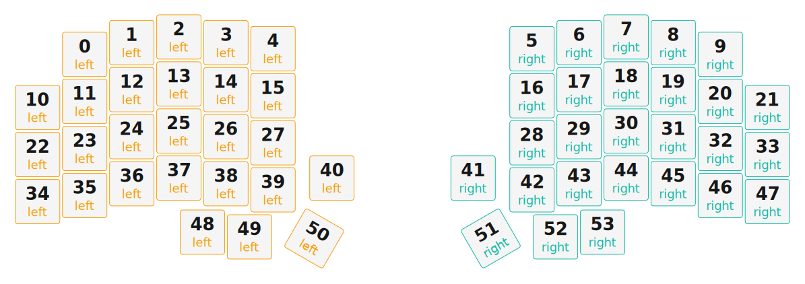

# ZMK Configuration for NorDex_54

*Generated by Shield Wizard for ZMK*



Download compiled firmware from the Actions tab. <https://zmk.dev/docs/user-setup#installing-the-firmware>

Edit your keymap <https://zmk.dev/docs/keymaps>.
User keymap is located at [`config/nordex_54.keymap`](config/nordex_54.keymap).

-----

<details>
<summary>
Shield Wizard Debug Information
</summary>

In case of broken configuration, here is the Shield Wizard internal data used to generate this configuration:

Commit: 1bc308cbed65fac144201644c2075be718bdbf1f

```json
{"name":"NorDex_54","shield":"nordex_54","dongle":false,"modules":[],"layout":[{"id":"01KKQR9H1WREKXSCC8MGK5B4D9","part":0,"row":0,"col":1,"w":1,"h":1,"x":1,"y":0.37,"r":0,"rx":0,"ry":0},{"id":"01KKQR9H1WTSSTF6HYC9Y83G0H","part":0,"row":0,"col":2,"w":1,"h":1,"x":2,"y":0.12,"r":0,"rx":0,"ry":0},{"id":"01KKQR9H1WYXXR1TTHHKSJQTKS","part":0,"row":0,"col":3,"w":1,"h":1,"x":3,"y":0,"r":0,"rx":0,"ry":0},{"id":"01KKQR9H1W7XDDEQ1BDCM0RW8Y","part":0,"row":0,"col":4,"w":1,"h":1,"x":4,"y":0.12,"r":0,"rx":0,"ry":0},{"id":"01KKQR9H1WGK53JSGE61WSBWB8","part":0,"row":0,"col":5,"w":1,"h":1,"x":5,"y":0.25,"r":0,"rx":0,"ry":0},{"id":"01KKQR9H1WVRSEW0X4SMXW56DW","part":1,"row":0,"col":8,"w":1,"h":1,"x":10.5,"y":0.25,"r":0,"rx":0,"ry":0},{"id":"01KKQR9H1WPW267HX53K7N3HQ9","part":1,"row":0,"col":9,"w":1,"h":1,"x":11.5,"y":0.12,"r":0,"rx":0,"ry":0},{"id":"01KKQR9H1W2VA89WYYSMCZ3DX2","part":1,"row":0,"col":10,"w":1,"h":1,"x":12.5,"y":0,"r":0,"rx":0,"ry":0},{"id":"01KKQR9H1WXD294RPB59JX1KTY","part":1,"row":0,"col":11,"w":1,"h":1,"x":13.5,"y":0.12,"r":0,"rx":0,"ry":0},{"id":"01KKQR9H1WGJJ8QG4J8TDFV32W","part":1,"row":0,"col":12,"w":1,"h":1,"x":14.5,"y":0.37,"r":0,"rx":0,"ry":0},{"id":"01KKQR9H1WVZSRZHBRXQWD2MWA","part":0,"row":1,"col":0,"w":1,"h":1,"x":0,"y":1.5,"r":0,"rx":0,"ry":0},{"id":"01KKQR9H1W3GSK1XJQ9NHWSE8D","part":0,"row":1,"col":1,"w":1,"h":1,"x":1,"y":1.37,"r":0,"rx":0,"ry":0},{"id":"01KKQR9H1WDY48QRKGB50S3G6T","part":0,"row":1,"col":2,"w":1,"h":1,"x":2,"y":1.12,"r":0,"rx":0,"ry":0},{"id":"01KKQR9H1WN7FKYYSPTZ6NRCEZ","part":0,"row":1,"col":3,"w":1,"h":1,"x":3,"y":1,"r":0,"rx":0,"ry":0},{"id":"01KKQR9H1WTKT8C2XC4TYCD7WZ","part":0,"row":1,"col":4,"w":1,"h":1,"x":4,"y":1.12,"r":0,"rx":0,"ry":0},{"id":"01KKQR9H1WHM1BBA3ETHHHQVK3","part":0,"row":1,"col":5,"w":1,"h":1,"x":5,"y":1.25,"r":0,"rx":0,"ry":0},{"id":"01KKQR9H1WV5414GY18JRM9NE7","part":1,"row":1,"col":8,"w":1,"h":1,"x":10.5,"y":1.25,"r":0,"rx":0,"ry":0},{"id":"01KKQR9H1W0HZ900P30ZDFACA9","part":1,"row":1,"col":9,"w":1,"h":1,"x":11.5,"y":1.12,"r":0,"rx":0,"ry":0},{"id":"01KKQR9H1WJJMG4CX8KXJJTSRM","part":1,"row":1,"col":10,"w":1,"h":1,"x":12.5,"y":1,"r":0,"rx":0,"ry":0},{"id":"01KKQR9H1W1RZP6WT2GR877S4Q","part":1,"row":1,"col":11,"w":1,"h":1,"x":13.5,"y":1.12,"r":0,"rx":0,"ry":0},{"id":"01KKQR9H1WPEM2CS9K7QZACB4F","part":1,"row":1,"col":12,"w":1,"h":1,"x":14.5,"y":1.37,"r":0,"rx":0,"ry":0},{"id":"01KKQR9H1WZMYPYBP5BD9B7K5S","part":1,"row":1,"col":13,"w":1,"h":1,"x":15.5,"y":1.5,"r":0,"rx":0,"ry":0},{"id":"01KKQR9H1WWEAB7M5KVJDKDQME","part":0,"row":2,"col":0,"w":1,"h":1,"x":0,"y":2.5,"r":0,"rx":0,"ry":0},{"id":"01KKQR9H1WM0NYPSRXJK31BT30","part":0,"row":2,"col":1,"w":1,"h":1,"x":1,"y":2.37,"r":0,"rx":0,"ry":0},{"id":"01KKQR9H1WH74204NQRH9NBVMA","part":0,"row":2,"col":2,"w":1,"h":1,"x":2,"y":2.12,"r":0,"rx":0,"ry":0},{"id":"01KKQR9H1WMJQJJEGJHT4NMX6D","part":0,"row":2,"col":3,"w":1,"h":1,"x":3,"y":2,"r":0,"rx":0,"ry":0},{"id":"01KKQR9H1WXTWXBF3N45B154E4","part":0,"row":2,"col":4,"w":1,"h":1,"x":4,"y":2.12,"r":0,"rx":0,"ry":0},{"id":"01KKQR9H1WECVSGNQ2SCNC4YXS","part":0,"row":2,"col":5,"w":1,"h":1,"x":5,"y":2.25,"r":0,"rx":0,"ry":0},{"id":"01KKQR9H1WFAXSNDQSJ5KCYM8N","part":1,"row":2,"col":8,"w":1,"h":1,"x":10.5,"y":2.25,"r":0,"rx":0,"ry":0},{"id":"01KKQR9H1W8BKG30DB2PSTXQJW","part":1,"row":2,"col":9,"w":1,"h":1,"x":11.5,"y":2.12,"r":0,"rx":0,"ry":0},{"id":"01KKQR9H1W55T1WPBS6V7R20MQ","part":1,"row":2,"col":10,"w":1,"h":1,"x":12.5,"y":2,"r":0,"rx":0,"ry":0},{"id":"01KKQR9H1WQ0ESPZCAVPGYMPR4","part":1,"row":2,"col":11,"w":1,"h":1,"x":13.5,"y":2.12,"r":0,"rx":0,"ry":0},{"id":"01KKQR9H1W698FHT6WB1PA37NC","part":1,"row":2,"col":12,"w":1,"h":1,"x":14.5,"y":2.37,"r":0,"rx":0,"ry":0},{"id":"01KKQR9H1WVD9ECX79K69T11D3","part":1,"row":2,"col":13,"w":1,"h":1,"x":15.5,"y":2.5,"r":0,"rx":0,"ry":0},{"id":"01KKQR9H1W9S7CTA871NCNBQ0R","part":0,"row":3,"col":0,"w":1,"h":1,"x":0,"y":3.5,"r":0,"rx":0,"ry":0},{"id":"01KKQR9H1W38Z9P27S899YG2DD","part":0,"row":3,"col":1,"w":1,"h":1,"x":1,"y":3.37,"r":0,"rx":0,"ry":0},{"id":"01KKQR9H1W19QQRPR4V85K169Z","part":0,"row":3,"col":2,"w":1,"h":1,"x":2,"y":3.12,"r":0,"rx":0,"ry":0},{"id":"01KKQR9H1WCGGRPCP69G3YNNW1","part":0,"row":3,"col":3,"w":1,"h":1,"x":3,"y":3,"r":0,"rx":0,"ry":0},{"id":"01KKQR9H1WYAAZWDP3TZDTRJ6W","part":0,"row":3,"col":4,"w":1,"h":1,"x":4,"y":3.12,"r":0,"rx":0,"ry":0},{"id":"01KKQR9H1WYNX0TQ5JK0J480AS","part":0,"row":3,"col":5,"w":1,"h":1,"x":5,"y":3.25,"r":0,"rx":0,"ry":0},{"id":"01KKQR9H1WK9HVRMPP274261PQ","part":0,"row":3,"col":6,"w":1,"h":1,"x":6.25,"y":3,"r":0,"rx":0,"ry":0},{"id":"01KKQR9H1WW2M2M07JZR9DGGYX","part":1,"row":3,"col":7,"w":1,"h":1,"x":9.25,"y":3,"r":0,"rx":0,"ry":0},{"id":"01KKQR9H1WWVGGFDEWQFDG0GZ9","part":1,"row":3,"col":8,"w":1,"h":1,"x":10.5,"y":3.25,"r":0,"rx":0,"ry":0},{"id":"01KKQR9H1WZJJ1N83ME206Z59Z","part":1,"row":3,"col":9,"w":1,"h":1,"x":11.5,"y":3.12,"r":0,"rx":0,"ry":0},{"id":"01KKQR9H1WA8ZPXNV18PSF4581","part":1,"row":3,"col":10,"w":1,"h":1,"x":12.5,"y":3,"r":0,"rx":0,"ry":0},{"id":"01KKQR9H1WV810AE4YVNDCW08C","part":1,"row":3,"col":11,"w":1,"h":1,"x":13.5,"y":3.12,"r":0,"rx":0,"ry":0},{"id":"01KKQR9H1W6S4G8DC5M5K5EC2K","part":1,"row":3,"col":12,"w":1,"h":1,"x":14.5,"y":3.37,"r":0,"rx":0,"ry":0},{"id":"01KKQR9H1WT23Z8NMTNQ8V70TG","part":1,"row":3,"col":13,"w":1,"h":1,"x":15.5,"y":3.5,"r":0,"rx":0,"ry":0},{"id":"01KKQR9H1WGPQ22KXZ44MB6EKC","part":0,"row":4,"col":4,"w":1,"h":1,"x":3.5,"y":4.15,"r":0,"rx":0,"ry":0},{"id":"01KKQR9H1WVF5GRYRSRTWQ3NFA","part":0,"row":4,"col":5,"w":1,"h":1,"x":4.5,"y":4.25,"r":0,"rx":0,"ry":0},{"id":"01KKQR9H1WYC7KM2DYRG2N5Q48","part":0,"row":4,"col":6,"w":1,"h":1,"x":5.75,"y":4.25,"r":30,"rx":6.25,"ry":5},{"id":"01KKQR9H1W8Q7HQQ8JE98DQ3E9","part":1,"row":4,"col":7,"w":1,"h":1,"x":9.75,"y":4.25,"r":-30,"rx":10.25,"ry":5},{"id":"01KKQR9H1WRGV4GMJPHSN0MBH8","part":1,"row":4,"col":8,"w":1,"h":1,"x":11,"y":4.25,"r":0,"rx":0,"ry":0},{"id":"01KKQR9H1WE5AZ77Q60SKVYG3A","part":1,"row":4,"col":9,"w":1,"h":1,"x":12,"y":4.15,"r":0,"rx":0,"ry":0}],"parts":[{"name":"left","controller":"nice_nano_v2","wiring":"matrix_diode","pins":{"d1":"output","d0":"output","d2":"output","d3":"output","d4":"output","d5":"output","d6":"output","d21":"input","d20":"input","d19":"input","d18":"input","d15":"input"},"keys":{"01KKQR9H1WVZSRZHBRXQWD2MWA":{"input":"d20","output":"d1"},"01KKQR9H1WWEAB7M5KVJDKDQME":{"input":"d19","output":"d1"},"01KKQR9H1W9S7CTA871NCNBQ0R":{"input":"d18","output":"d1"},"01KKQR9H1WREKXSCC8MGK5B4D9":{"input":"d21","output":"d0"},"01KKQR9H1W3GSK1XJQ9NHWSE8D":{"input":"d20","output":"d0"},"01KKQR9H1WM0NYPSRXJK31BT30":{"input":"d19","output":"d0"},"01KKQR9H1W38Z9P27S899YG2DD":{"input":"d18","output":"d0"},"01KKQR9H1WTSSTF6HYC9Y83G0H":{"input":"d21","output":"d2"},"01KKQR9H1WDY48QRKGB50S3G6T":{"input":"d20","output":"d2"},"01KKQR9H1WH74204NQRH9NBVMA":{"input":"d19","output":"d2"},"01KKQR9H1W19QQRPR4V85K169Z":{"input":"d18","output":"d2"},"01KKQR9H1WYXXR1TTHHKSJQTKS":{"input":"d21","output":"d3"},"01KKQR9H1WN7FKYYSPTZ6NRCEZ":{"input":"d20","output":"d3"},"01KKQR9H1WMJQJJEGJHT4NMX6D":{"input":"d19","output":"d3"},"01KKQR9H1WCGGRPCP69G3YNNW1":{"input":"d18","output":"d3"},"01KKQR9H1W7XDDEQ1BDCM0RW8Y":{"input":"d21","output":"d4"},"01KKQR9H1WTKT8C2XC4TYCD7WZ":{"input":"d20","output":"d4"},"01KKQR9H1WXTWXBF3N45B154E4":{"input":"d19","output":"d4"},"01KKQR9H1WYAAZWDP3TZDTRJ6W":{"input":"d18","output":"d4"},"01KKQR9H1WGPQ22KXZ44MB6EKC":{"input":"d15","output":"d4"},"01KKQR9H1WGK53JSGE61WSBWB8":{"input":"d21","output":"d5"},"01KKQR9H1WHM1BBA3ETHHHQVK3":{"input":"d20","output":"d5"},"01KKQR9H1WECVSGNQ2SCNC4YXS":{"input":"d19","output":"d5"},"01KKQR9H1WYNX0TQ5JK0J480AS":{"input":"d18","output":"d5"},"01KKQR9H1WVF5GRYRSRTWQ3NFA":{"input":"d15","output":"d5"},"01KKQR9H1WK9HVRMPP274261PQ":{"input":"d18","output":"d6"},"01KKQR9H1WYC7KM2DYRG2N5Q48":{"input":"d15","output":"d6"}},"encoders":[],"buses":[{"name":"spi0","devices":[],"type":"spi"},{"name":"spi1","devices":[],"type":"spi"},{"name":"spi2","devices":[],"type":"spi"},{"name":"spi3","devices":[],"type":"spi"},{"name":"i2c0","devices":[],"type":"i2c"},{"name":"i2c1","devices":[],"type":"i2c"}]},{"name":"right","controller":"nice_nano_v2","wiring":"matrix_diode","pins":{"d1":"output","d0":"output","d2":"output","d3":"output","d4":"output","d5":"output","d6":"output","d21":"input","d20":"input","d19":"input","d18":"input","d15":"input"},"keys":{"01KKQR9H1WW2M2M07JZR9DGGYX":{"input":"d18","output":"d1"},"01KKQR9H1W8Q7HQQ8JE98DQ3E9":{"input":"d15","output":"d1"},"01KKQR9H1WVRSEW0X4SMXW56DW":{"input":"d21","output":"d0"},"01KKQR9H1WV5414GY18JRM9NE7":{"input":"d20","output":"d0"},"01KKQR9H1WFAXSNDQSJ5KCYM8N":{"input":"d19","output":"d0"},"01KKQR9H1WWVGGFDEWQFDG0GZ9":{"input":"d18","output":"d0"},"01KKQR9H1WRGV4GMJPHSN0MBH8":{"input":"d15","output":"d0"},"01KKQR9H1WPW267HX53K7N3HQ9":{"input":"d21","output":"d2"},"01KKQR9H1W0HZ900P30ZDFACA9":{"input":"d20","output":"d2"},"01KKQR9H1W8BKG30DB2PSTXQJW":{"input":"d19","output":"d2"},"01KKQR9H1WZJJ1N83ME206Z59Z":{"input":"d18","output":"d2"},"01KKQR9H1WE5AZ77Q60SKVYG3A":{"input":"d15","output":"d2"},"01KKQR9H1W2VA89WYYSMCZ3DX2":{"input":"d21","output":"d3"},"01KKQR9H1WJJMG4CX8KXJJTSRM":{"input":"d20","output":"d3"},"01KKQR9H1W55T1WPBS6V7R20MQ":{"input":"d19","output":"d3"},"01KKQR9H1WA8ZPXNV18PSF4581":{"input":"d18","output":"d3"},"01KKQR9H1WXD294RPB59JX1KTY":{"input":"d21","output":"d4"},"01KKQR9H1W1RZP6WT2GR877S4Q":{"input":"d20","output":"d4"},"01KKQR9H1WQ0ESPZCAVPGYMPR4":{"input":"d19","output":"d4"},"01KKQR9H1WV810AE4YVNDCW08C":{"input":"d18","output":"d4"},"01KKQR9H1WGJJ8QG4J8TDFV32W":{"input":"d21","output":"d5"},"01KKQR9H1WPEM2CS9K7QZACB4F":{"input":"d20","output":"d5"},"01KKQR9H1W698FHT6WB1PA37NC":{"input":"d19","output":"d5"},"01KKQR9H1W6S4G8DC5M5K5EC2K":{"input":"d18","output":"d5"},"01KKQR9H1WZMYPYBP5BD9B7K5S":{"input":"d20","output":"d6"},"01KKQR9H1WVD9ECX79K69T11D3":{"input":"d19","output":"d6"},"01KKQR9H1WT23Z8NMTNQ8V70TG":{"input":"d18","output":"d6"}},"encoders":[],"buses":[{"name":"spi0","devices":[],"type":"spi"},{"name":"spi1","devices":[],"type":"spi"},{"name":"spi2","devices":[],"type":"spi"},{"name":"spi3","devices":[],"type":"spi"},{"name":"i2c0","devices":[],"type":"i2c"},{"name":"i2c1","devices":[],"type":"i2c"}]}]}
```

</details>
